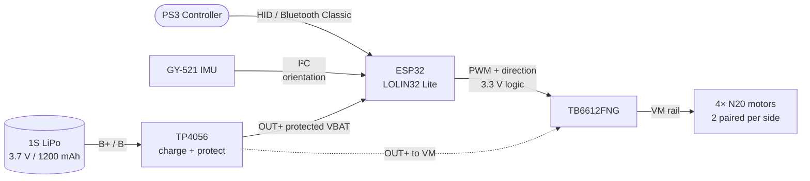
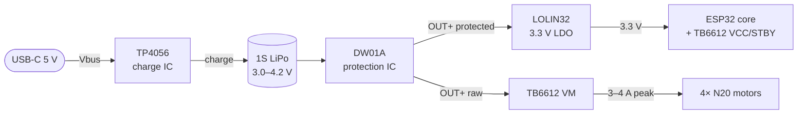

# minibot

A small invertible 4WD ESP32 robot driven by a PS3 controller over Bluetooth.

[](https://github.com/wouterds/minibot/actions/workflows/build.yml)
[](https://platformio.org)

## Overview

- **ESP32 (WeMos LOLIN32 Lite)** — WiFi + Bluetooth Classic
- **PS3 DualShock 3 controller** as the wireless remote (BT Classic + HID)
- **4× N20 6 V / 400 RPM** gear motors, paired left/right through a single **TB6612FNG** dual H-bridge
- **GY-521 (MPU6050) IMU** for orientation detection — auto-flips drive direction when the bot is upside-down
- **TP4056 USB-C charge + DW01A protection board** — handles charging, overcharge, overdischarge and short-circuit protection
- **1S LiPo 3.7 V / 1200 mAh**, ~1 hour of cruising
- **3D-printed PETG translucent chassis** — fully enclosed (3 mm walls all around), invertible, ~150 × 110 × 18 mm

## System



## Wiring

| ESP32 pin | Destination | Purpose |
|---|---|---|
| `3V3` | TB6612 `VCC` + `STBY`, GY-521 `VCC` | Logic supply, chip enable |
| `GND` | All `GND` | Common ground |
| `+` (VBAT) | TB6612 `VM` (from TP4056 `OUT+`) | Motor supply, protected battery (3–4.2 V) |
| `GPIO 19` | Status LED | Connection indicator |
| `GPIO 21` | GY-521 `SDA` | I²C data (IMU) |
| `GPIO 22` | GY-521 `SCL` | I²C clock (IMU) |
| `GPIO 13` | TB6612 `PWMA` | Left side speed |
| `GPIO 14` | TB6612 `AIN1` | Left side direction bit 1 |
| `GPIO 27` | TB6612 `AIN2` | Left side direction bit 2 |
| `GPIO 26` | TB6612 `PWMB` | Right side speed |
| `GPIO 16` | TB6612 `BIN1` | Right side direction bit 1 |
| `GPIO 17` | TB6612 `BIN2` | Right side direction bit 2 |

The two motors on each side are wired in parallel to a single driver channel — `AO1` / `AO2` drive both left motors, `BO1` / `BO2` both right motors. See [`research.md`](research.md) for the design rationale.

## Power



USB-C plugs into the **TP4056** board: it charges the battery (constant-current → constant-voltage) and the paired **DW01A** protects against overcharge, overdischarge, overcurrent, and short-circuit. The **OUT+ / OUT-** terminals are the protected battery output that feeds both the LOLIN32's 3.3 V LDO and the TB6612's VM rail. The LOLIN32's onboard TP4054 + JST connector is left unused — battery only ever connects to the TP4056's `B+ / B-`.


## Chassis


Two identical tray-shaped plates (3 mm floor + 6 mm half-walls) join open-face-to-open-face into a closed box. Four motors mount in half-cylinder pockets in each plate, shafts pointing outward toward the side walls. Wheels sit on the shafts close to but inside the walls, and protrude only through cutouts in the top and bottom plates. Nothing is exposed laterally.

The parametric source is at [`docs/cad/chassis.scad`](docs/cad/chassis.scad). Render to STL with OpenSCAD:

```sh
openscad --export-format=stl -o plate.stl docs/cad/chassis.scad
```

Print the same shape twice — the chassis is invertible.

### Print settings

| Setting | Value |
|---|---|
| Material | PETG translucent |
| Plate thickness | 3 mm |
| Layer height | 0.2 mm |
| Infill | 25–30 % gyroid |
| Perimeters | 3–4 walls |
| Orientation | Plates flat on the bed |
| Mounting | M3 heat-set inserts in the corner bosses |

## Parts

Quick summary — see [`docs/parts.md`](docs/parts.md) for the full list with vendors.

| Component | Qty | ~Cost |
|---|---|---:|
| ESP32 LOLIN32 Lite | 1 | €5–8 |
| TB6612FNG breakout | 1 | €1.50 |
| N20 6 V 400 RPM motor, 20 mm shaft | 4 | €10 |
| SLT20 33×20 mm wheel | 4 | €7.20 |
| GY-521 (MPU6050) IMU module | 1 | €1.50 |
| TP4056 USB-C charge + DW01A protection board | 1 | €1–2 |
| 1S LiPo 1200 mAh | 1 | €6 |
| PETG translucent (chassis) | ~50 g | €1–2 |
| M3 hardware, wire, heat-shrink | — | €5–8 |
| PS3 controller (reuse) | 1 | €0–20 |
| **Total (minimum viable build)** | | **~€33–44** |
