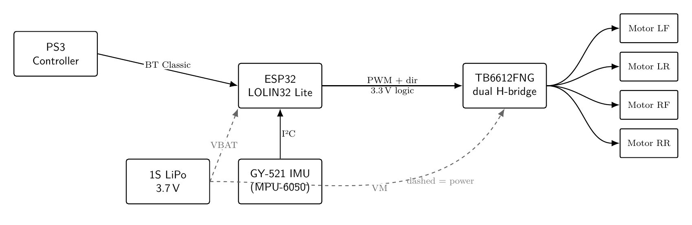
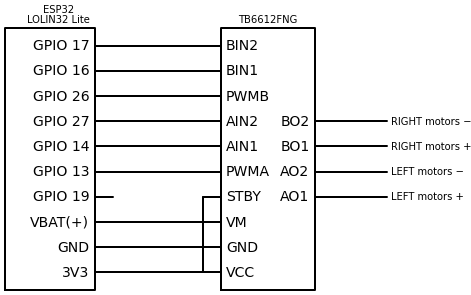
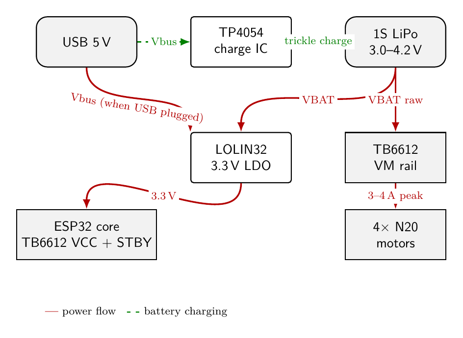
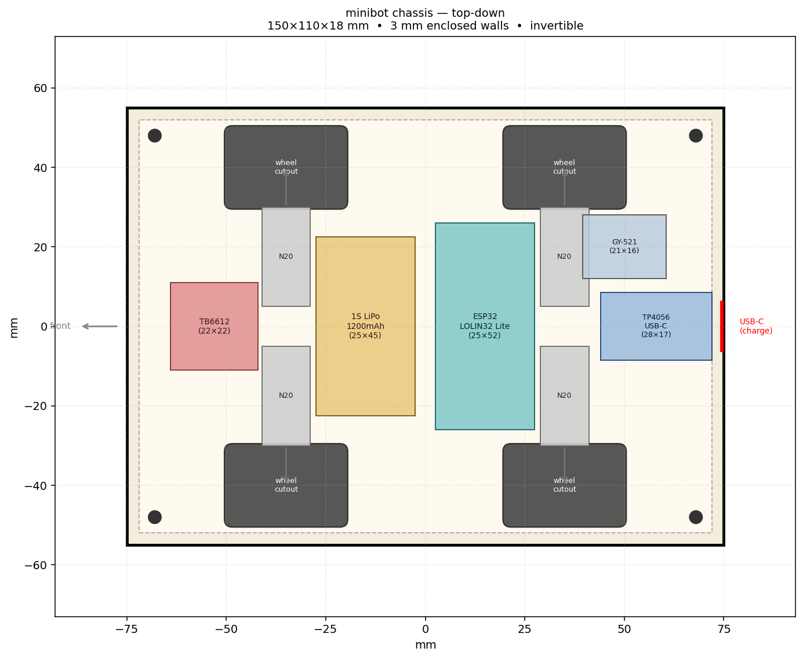

# minibot

A tiny invertible 4WD ESP32 robot driven by a PS3 controller over Bluetooth.

[](https://github.com/wouterds/minibot/actions/workflows/build.yml)
[](LICENSE)
[](https://platformio.org)

## What it is

A small wireless RC bot with:

- **ESP32 (WeMos LOLIN32 Lite)** brain — WiFi + Bluetooth Classic + onboard LiPo charging
- **PS3 DualShock 3 controller** as the wireless remote (BT Classic + HID)
- **4× N20 6V 400 RPM** geared motors, paired left/right and driven by a single **TB6612FNG** dual H-bridge
- **PETG translucent 3D-printed chassis** in a motor-sandwich layout that's **invertible** — drives the same flipped over
- **1S LiPo 3.7 V 1200 mAh** for ~1 hour of cruising

Everything fits in roughly **120 × 130 × 18 mm**, fully enclosed with 3 mm walls on all sides — no parts protrude laterally.

## System diagram



The PS3 controller pairs once over USB then auto-connects to the ESP32 over Bluetooth. The ESP32 generates PWM and direction signals for the TB6612FNG, which switches battery voltage to the motors. Logic and motor power both come from the LiPo via two rails (regulated 3.3 V from the LOLIN32's onboard LDO and raw VBAT direct to the driver's VM).

## Wiring



| ESP32 pin | TB6612FNG pin | Purpose |
|---|---|---|
| `3V3` | `VCC` + `STBY` | Logic supply, chip enable |
| `GND` | `GND` | Common ground |
| `VBAT (+)` | `VM` | Motor supply (battery, 3–4.2 V) |
| `GPIO 19` | (status LED) | Connection indicator |
| `GPIO 13` | `PWMA` | Left side speed |
| `GPIO 14` | `AIN1` | Left side direction bit 1 |
| `GPIO 27` | `AIN2` | Left side direction bit 2 |
| `GPIO 26` | `PWMB` | Right side speed |
| `GPIO 16` | `BIN1` | Right side direction bit 1 |
| `GPIO 17` | `BIN2` | Right side direction bit 2 |

The two motors on each side are wired **in parallel** to the same driver channel — `AO1`/`AO2` drive both left motors, `BO1`/`BO2` both right motors. See [research.md](research.md#paired-motors-per-side) for the trade-offs.

### Power distribution



## Chassis



The chassis is **two identical tray-shaped PETG plates** that join open-face-to-open-face to form a closed box. Each plate is a 3 mm flat floor with 6 mm half-walls around its perimeter; stacked they form an **18 mm tall enclosed shell** (3 + 6 + 6 + 3) with 3 mm side walls all around. Motors mount **shaft-inward** so the wheels sit *entirely inside* the chassis perimeter — nothing exposed laterally. Wheels poke through cutouts in the top and bottom plates only, protruding **~7.5 mm above and below** for ground contact. Result: a fully enclosed, **invertible** bot that drives the same on either face.

The parametric OpenSCAD source is at [`docs/cad/chassis.scad`](docs/cad/chassis.scad). Render to STL:

```sh
openscad --export-format=stl -o top.stl    -D 'plate_kind="top"'    docs/cad/chassis.scad
openscad --export-format=stl -o bottom.stl -D 'plate_kind="bottom"' docs/cad/chassis.scad
```

The matplotlib top-down preview above can be regenerated with `docs/cad/layout.py` (uses `uv` + PEP 723 inline deps).

### Print settings

| Setting | Value |
|---|---|
| Material | **PETG translucent** |
| Plate thickness | 3 mm |
| Layer height | 0.2 mm |
| Infill | 25–30 % gyroid |
| Perimeters | 3–4 walls |
| Orientation | Plates printed **flat** on the bed |
| Mounting | M3 heat-set inserts in printed bosses |

## Bill of materials

Quick summary — see [`docs/bom.md`](docs/bom.md) for the full list with sources.

| Component | Qty | ~Cost |
|---|---|---:|
| ESP32 LOLIN32 Lite | 1 | €5–8 |
| TB6612FNG breakout | 1 | €1.50 |
| N20 6V 400 RPM motor, 20 mm shaft | 4 | €10 |
| SLT20 33×20 mm wheel | 4 | €7.20 |
| 1S LiPo 1200 mAh | 1 | €6 |
| PETG translucent (chassis) | ~50 g | €1–2 |
| M3 hardware + wire + heat-shrink | — | €5–8 |
| PS3 controller (reuse) | 1 | €0–20 |
| **Total (minimum viable)** | | **~€30–40** |
| **Total (with spares + new controller)** | | **~€55–80** |

## Hardware setup

1. **Print the chassis plates** from PETG translucent (see settings above).
2. **Press M3 heat-set inserts** into the four corner bosses on one plate.
3. **Solder wires directly to the LOLIN32 Lite and TB6612FNG** (no headers — keeps everything flush in the 12 mm cavity).
4. **Wire** per the table above; double-check `VM`/`VCC` aren't swapped.
5. **Solder the two left motors in parallel** to `AO1`/`AO2`, both right motors to `BO1`/`BO2`. If a motor spins the wrong way after first boot, swap that motor's two leads at the driver output.
6. **Mount motors** into the half-pockets, sandwich between plates, screw the M3s through both plates into the heat-set inserts.
7. **Plug in the battery** via the JST PH2.0 on the LOLIN32. Onboard TP4054 will charge it whenever USB is plugged in.

## Software setup

### Prerequisites

- **macOS / Linux / Windows** with VSCode + [PlatformIO IDE](https://platformio.org/platformio-ide)
- [`uv`](https://docs.astral.sh/uv/) (for the PS3 pairing script)
- [`lefthook`](https://github.com/evilmartians/lefthook) (`brew install lefthook` — for commit hooks)
- USB cable for first programming

### Build and flash

```sh
git clone https://github.com/wouterds/minibot
cd minibot
lefthook install      # optional, sets up commit-msg hook

# in VSCode: PlatformIO sidebar → Project Tasks → esp32dev → Upload
# or:
pio run -t upload -t monitor
```

First build downloads the ESP32 toolchain (~few hundred MB, one-time, 5–10 min). Subsequent builds are seconds.

## Pairing the PS3 controller

The PS3 stores a single host MAC internally — it only connects to that one address. To pair to this ESP32:

```sh
# Plug controller into your Mac via USB, then:
./scripts/pair-ps3.py 24:6f:28:b1:f8:b6
```

That MAC is the ESP32's burned-in Bluetooth MAC (base + 2 — see [research.md § PS3 pairing](research.md#ps3-controller-pairing)). Replace it with your own ESP32's BT MAC if it's a different chip.

After pairing, unplug USB and press the PS button. The status LED on GPIO 19 turns solid when connected.

## Controls (current firmware)

| Input | Effect |
|---|---|
| △ Triangle | Toggle LED on GPIO 17 |
| ○ Circle | Toggle LED on GPIO 33 |
| ✕ Cross | Toggle LED on GPIO 32 |
| □ Square | Toggle LED on GPIO 25 |
| Left stick ↑/↓ | Ramp global LED brightness up/down |
| Disconnect | All LEDs off, status LED blinks |

(LEDs are currently sub'd in for the motor driver until parts arrive — see the next firmware iteration for tank-drive controls.)

## Project structure

```
minibot/
├── .clang-format              C++ style config
├── .github/workflows/         CI (PlatformIO build on push/PR)
├── docs/
│   ├── bom.md                 Bill of materials
│   ├── cad/
│   │   ├── chassis.scad       Parametric OpenSCAD chassis source
│   │   ├── layout.py          Top-down PNG generator
│   │   └── layout.png
│   └── schematics/
│       ├── generate.py        Schemdraw → PNG generator
│       ├── system.png
│       ├── wiring.png
│       └── power.png
├── platformio.ini             PlatformIO build config (ESP32 + Arduino)
├── research.md                Deep-dive design notes
├── scripts/
│   └── pair-ps3.py            PS3 controller pairing helper (HID over USB)
└── src/
    ├── main.cpp               setup() / loop() orchestrator
    ├── config.h               Pin assignments, PWM settings, host MAC
    ├── controller.h/.cpp      PS3 controller setup + callbacks
    ├── leds.h/.cpp            Face-button LED PWM module
    └── status_led.h/.cpp      Connection-status LED module
```

## Roadmap

- [x] PS3 controller pairing + button events over BT
- [x] LED feedback for buttons + brightness ramp
- [x] Atomic, commit-message-clean git history
- [x] CI + clang-format + LICENSE
- [x] Schematics + chassis CAD
- [ ] Drive motor logic (tank steering: left stick → left side, right stick → right side)
- [ ] Auto-invert via IMU (MPU6050) when flipped
- [ ] NeoPixel strip for ambient + direction indication
- [ ] WiFi OTA flashing
- [ ] Battery voltage monitoring + low-battery warning
- [ ] Ultrasonic obstacle avoidance (HC-SR04)
- [ ] Closed-loop speed control with N20 hall encoders
- [ ] Web UI fallback control

## License

[MIT](LICENSE) — do whatever you want, no warranty.

---

Built with `Claude Code` — see [research.md](research.md) for a running design journal.
